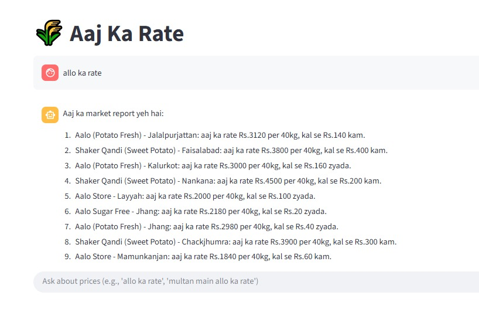

# 🌾 Aaj Ka Rate — Market Price Chatbot

**Aaj Ka Rate** is an advanced **AI-powered agricultural market price analyzer** built with **Streamlit**, **LangChain**, and **Groq’s LLaMA 3.3 model**.  
It provides **real-time commodity prices** across major Pakistani cities in **Urdu**, **Roman Urdu**, or **English**.  

The app automatically scrapes official data from [AMIS Pakistan](https://amis.pk) and generates multilingual market reports for farmers, traders, and agri analysts.

---

## 🖼️ Screenshot



> 📸 The screenshot file `market.jpg` is in the same folder as this README file.

---

## 🚀 Live Demo

👉 **[Try Live App — Aaj Ka Rate](https://pak-market.streamlit.app/)**

---

## 🧩 Features

✅ Real-time market data scraping from **AMIS Pakistan**  
✅ Multilingual chat support (**Urdu**, **Roman Urdu**, **English**)  
✅ LLM-powered **price reporting and translation**  
✅ Fuzzy matching for city and commodity recognition  
✅ **Interactive tables** and **data visualizations** using Plotly  
✅ **Background data updater** with automatic refresh  
✅ Built-in **LangChain + Groq API** integration  
✅ Designed for **Pakistani agriculture ecosystem**

---

## 🧠 Tech Stack

- **Python 3.10+**  
- **Streamlit** — Interactive Web App  
- **LangChain** + **Groq API (LLaMA 3.3-70B)** — LLM intelligence  
- **Pandas** — Data handling  
- **BeautifulSoup** — Web scraping  
- **Plotly** — Interactive charts  
- **FuzzyWuzzy** — Query matching  
- **Schedule + Threading** — Auto data updates  

---

## ⚙️ Run Locally

You can set up and run this project on your computer by following these steps 👇

### 1️⃣ Clone the Repository

```bash
git clone https://github.com/ZainMushtaq9/Market-Price.git
cd Market-Price
